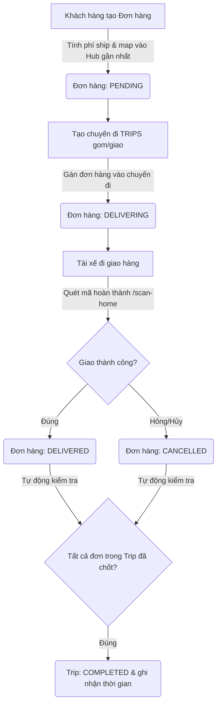

# SPX Mini Core

Hệ thống Core Logistics thu nhỏ (lấy cảm hứng từ Shopee Express), thiết kế để thử nghiệm và thực hành các tính năng của FastAPI + SQLAlchemy + PostgreSQL. 

Dự án tập trung vào luồng xử lý cốt lõi của một hệ thống logistics: **Tạo đơn hàng -> Tính phí tự động -> Tạo chuyến đi gom/giao hàng -> Quét mã cập nhật trạng thái đơn (Scan Event) -> Tự động chốt trạng thái chuyến đi**.

---

## 🛠️ Tech Stack & Cấu trúc thư mục

*   **Framework:** FastAPI (Python 3.10+)
*   **Database:** PostgreSQL + SQLAlchemy (ORM)
*   **Data Validation:** Pydantic v2
*   **Cơ chế lưu trữ khoảng cách:** RAM-cached JSON (tải danh sách khoảng cách giữa các tỉnh khi khởi động server).

```text
SPX-mini-core/
├── app/
│   ├── main.py                 # Điểm khởi chạy app & đăng ký Router
│   ├── database.py             # Cấu hình kết nối PostgreSQL (Session & Engine)
│   ├── models.py               # Định nghĩa Database Schema (SQLAlchemy Models)
│   ├── schemas.py              # Định nghĩa Data Schemas (Pydantic Models)
│   ├── routers/                # Chứa các API endpoints chia theo module
│   │   ├── users.py            # Quản lý tài xế, khách hàng
│   │   ├── orders.py           # Quản lý đơn hàng (tạo, cập nhật, xóa)
│   │   ├── trips.py            # Điều phối chuyến đi (gom/giao hàng)
│   │   └── events.py           # Quét mã chuyển trạng thái (luồng vận hành)
│   ├── services/
│   │   ├── order_service.py    # Xử lý logic tính phí ship dựa trên khoảng cách & trọng lượng
│   │   └── provinces_distance.json  # Ma trận khoảng cách giữa các tỉnh miền Bắc
│   └── data_seed.py            # Script khởi tạo dữ liệu mẫu (Hub, tỉnh thành, xe, tài xế)
├── docker-compose.yml          # Container chạy PostgreSQL
└── requirements.txt            # Danh sách dependencies
```

---

## ⚙️ Hướng dẫn cài đặt & Khởi chạy

### 1. Chuẩn bị môi trường & Database
Tạo file `.env` tại thư mục gốc với các thông số kết nối Database:
```env
DB_USER=postgres
DB_PASSWORD=1234
DB_HOST=localhost
DB_PORT=5432
DB_NAME=postgres
```

Khởi chạy PostgreSQL container bằng Docker Compose:
```bash
docker-compose up -d
```
*(Lưu ý: Đảm bảo biến môi trường trong file `.env` khớp với cổng và thông tin đăng nhập trong file `docker-compose.yml`)*

### 2. Cài đặt Python Virtual Environment & Dependencies
```bash
# Tạo môi trường ảo
python -m venv venv

# Kích hoạt môi trường ảo (Windows)
.\venv\Scripts\activate

# Cài đặt thư viện
pip install -r requirements.txt
```

### 3. Seed dữ liệu mẫu (Quan trọng)
Hệ thống tính phí ship dựa trên cấu trúc các Tỉnh/Huyện và Hub đã được xác định trước. Hãy chạy script seed để khởi tạo dữ liệu mẫu (25 tỉnh miền Bắc, danh sách quận/huyện tương ứng, 20 tài xế và hệ thống Hub/Xe):
```bash
python -m app.data_seed
```

### 4. Chạy Server
```bash
uvicorn app.main:app --reload
```
Truy cập tài liệu API tự động tại: [http://127.0.0.1:8000/docs](http://127.0.0.1:8000/docs)

---

## 🔄 Luồng vận hành cốt lõi (Core Flows)



1.  **Tạo đơn hàng (`POST /orders/`)**: Hệ thống tự động tính phí vận chuyển dựa trên khoảng cách giữa tỉnh gửi và tỉnh nhận (đọc từ `provinces_distance.json`) cùng trọng lượng đơn hàng. Đồng thời gán `origin_hub_id` và `destination_hub_id` dựa trên quận/huyện của người gửi/nhận.
2.  **Tạo chuyến đi giao hàng (`POST /trips/`)**: Gom danh sách `order_ids` gán cho một tài xế (`driver_id`) và phương tiện (`vehicle_id`). Trạng thái các đơn hàng lập tức chuyển sang `delivering`.
3.  **Quét mã giao hàng (`POST /events/scan-home`)**: Tài xế chốt kết quả giao hàng (`delivered` hoặc `cancelled`). Hệ thống tự động cập nhật trạng thái chi tiết của chuyến đi (`trips_detail`). Khi toàn bộ các đơn hàng trong chuyến được chốt, chuyến đi sẽ tự động chuyển trạng thái sang `COMPLETED` và cập nhật thời gian đến (`arrived_time`).
