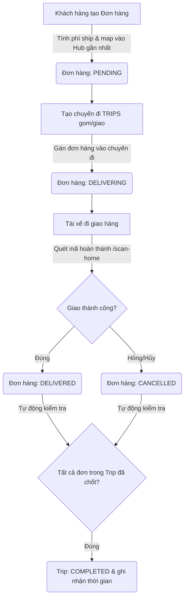

# SPX Mini Core

Hệ thống Core Logistics thu nhỏ (lấy cảm hứng từ quy trình giao hàng thực tế), thiết kế để thử nghiệm và thực hành các tính năng của FastAPI + SQLAlchemy + PostgreSQL.

Dự án tập trung vào luồng xử lý cốt lõi của một hệ thống logistics: **Tạo đơn hàng -> Tính phí tự động -> Tạo chuyến đi gom/giao hàng -> Quét mã cập nhật trạng thái đơn (Scan Event) -> Tự động chốt trạng thái chuyến đi**.

---

## 🛠️ Tech Stack & Cấu trúc thư mục

*   **Framework:** FastAPI (Python 3.10+)
*   **Database:** PostgreSQL + SQLAlchemy (ORM)
*   **Data Validation:** Pydantic v2
*   **Testing:** Pytest
*   **Cơ chế lưu trữ khoảng cách:** RAM-cached JSON (tải danh sách khoảng cách giữa các tỉnh khi khởi động server).
*   **Môi trường:** Docker, Docker Compose

```text
SPX-mini-core/
├── app/
│   ├── main.py                 # Điểm khởi chạy app & đăng ký Router
│   ├── database.py             # Cấu hình kết nối PostgreSQL (Session & Engine)
│   ├── models.py               # Định nghĩa Database Schema (SQLAlchemy Models)
│   ├── schemas.py              # Định nghĩa Data Schemas (Pydantic Models)
│   ├── routers/                # Chứa các API endpoints chia theo module
│   │   ├── users.py            # Quản lý người dùng, tài xế
│   │   ├── orders.py           # Quản lý đơn hàng (tạo, cập nhật, xóa)
│   │   ├── trips.py            # Điều phối chuyến đi (gom/giao hàng)
│   │   └── events.py           # Quét mã chuyển trạng thái (luồng vận hành)
│   ├── services/
│   │   ├── order_service.py    # Xử lý logic tính phí ship dựa trên khoảng cách & trọng lượng
│   │   └── provinces_distance.json  # Ma trận khoảng cách giữa các tỉnh
│   └── data_seed.py            # Script khởi tạo dữ liệu mẫu (Hub, tỉnh thành, xe, tài xế)
├── tests/                      # Thư mục chứa các script test tự động hóa (Pytest)
│   ├── test_api.py             # Test API endpoints
│   └── test_performance.py     # Test hiệu suất
├── Dockerfile                  # Đóng gói backend service
├── docker-compose.yml          # Container chạy PostgreSQL & FastAPI
├── requirements.txt            # Danh sách thư viện Python
└── .env.example                # Mẫu cấu hình biến môi trường
```

---

## ⚙️ Hướng dẫn cài đặt & Khởi chạy

Bạn có thể chạy dự án thông qua 2 cách: **Sử dụng Docker hoàn toàn** hoặc **Chạy Local (Virtual Environment) kết hợp Database Docker**.

### 1. Chuẩn bị biến môi trường
Tạo file `.env` tại thư mục gốc dựa trên file `.env.example`:
```env
POSTGRES_USER=postgres
POSTGRES_PASSWORD=1234
POSTGRES_HOST=localhost
POSTGRES_PORT=5432
POSTGRES_DB=postgres
```
*(Nếu sử dụng Docker Compose cho cả backend và database, `POSTGRES_HOST` sẽ tự động được sử dụng là `postgres_db` bên trong container mạng, xem `docker-compose.yml`)*

---

### Cách 1: Khởi chạy hoàn toàn bằng Docker Compose (Khuyến nghị)
Phù hợp để deploy nhanh chóng không cần thiết lập Python local.

```bash
# Build và chạy cả Database lẫn Backend API
docker-compose up -d --build
```
Dịch vụ API sẽ được ánh xạ ra cổng `8000` của máy host. Bạn có thể truy cập ngay API Docs: [http://localhost:8000/docs](http://localhost:8000/docs)

---

### Cách 2: Chạy Local (Môi trường ảo)
Phù hợp để phát triển (development) và debug.

**Bước 1: Khởi chạy PostgreSQL container**
```bash
docker-compose up -d postgres_db
```

**Bước 2: Cài đặt Python Virtual Environment & Dependencies**
```bash
# Tạo môi trường ảo
python -m venv venv

# Kích hoạt môi trường ảo (Windows)
.\venv\Scripts\activate
# Hoặc trên Linux/MacOS: source venv/bin/activate

# Cài đặt thư viện
pip install -r requirements.txt
```

**Bước 3: Seed dữ liệu mẫu (Quan trọng)**
Hệ thống tính phí ship dựa trên cấu trúc các Tỉnh/Huyện và Hub đã được xác định trước. Chạy script seed để khởi tạo dữ liệu mẫu (Tỉnh thành, hệ thống Hub, Xe, và Users):
```bash
python -m app.data_seed
```

**Bước 4: Chạy Server**
```bash
uvicorn app.main:app --reload
```
Truy cập tài liệu API tự động tại: [http://127.0.0.1:8000/docs](http://127.0.0.1:8000/docs)

---

## 🧪 Chạy Automated Tests

Dự án sử dụng `pytest` để đảm bảo API và logic hoạt động đúng.

```bash
# Đảm bảo môi trường ảo đã được kích hoạt
pytest tests/
```

---

## 🔄 Luồng vận hành cốt lõi (Core Flows)



1.  **Tạo đơn hàng (`POST /orders/`)**: Hệ thống tự động tính phí vận chuyển dựa trên khoảng cách (trong `provinces_distance.json`) cùng trọng lượng đơn. Tự động gán `origin_hub_id` và `destination_hub_id` dựa trên tuyến Tỉnh - Huyện.
2.  **Tạo chuyến đi (`POST /trips/`)**: Gom các `order_ids` gán cho tài xế (`driver_id`) và xe (`vehicle_id`). Trạng thái các đơn hàng chuyển sang `DELIVERING`. Hệ thống hỗ trợ đa dạng loại hình chuyến đi (Giao, Lấy, Trung chuyển).
3.  **Quét mã giao hàng (`POST /events/scan-home`)**: Tài xế cập nhật trạng thái đơn sau khi giao (`delivered` hoặc `cancelled`). Khi **toàn bộ** đơn trong chuyến được xử lý xong, chuyến đi tự động đóng (chuyển sang `COMPLETED`) và lưu `arrived_time`.
